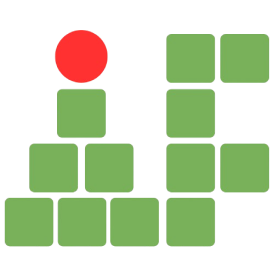

# ♟️SITE DO IFCC &middot;   
 

## 🚀 Propósito: 
Este site foi desenvolvido como forma de oferecer ao **Instituto Federal de São Paulo** uma plataforma para praticar, estudar, acompanhar e discutir o jogo de xadrez, como forma de apoio aos projetos de eventos e propagação do jogo pelo **Clube de Xadrez** do campus de Jacareí, visando a expansão do alcance das atividades propostas e o oferecimento de um ambiente útil e acolhedor para todos os estudantes amantes do jogo de xadrez.
